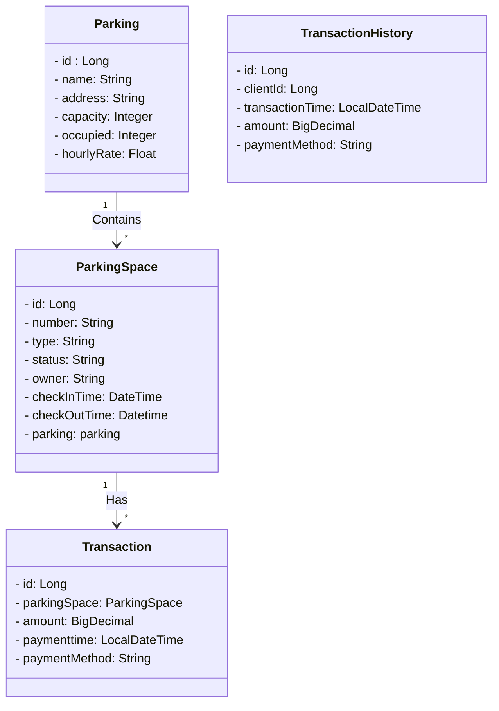

## Bootcamp Santander Backend Java 2023
Java RESTful API - publicação railway https://parking-production-1e47.up.railway.app/swagger-ui/index.html

### Diagrama de Classes

classDiagram




## Documentação do Projeto Estacionamento

### Introdução

Este projeto envolve o desenvolvimento de uma API REST em Java utilizando o Spring Boot na versão 17. A API tem como objetivo fornecer funcionalidades relacionadas a estacionamentos.

### Escopo do Projeto

#### Cadastro de Estacionamentos:

Permitir o cadastro de diferentes estacionamentos, incluindo informações como nome, endereço, capacidade de vagas e taxa horária.

#### Cadastro de Vagas de Estacionamento:

Permitir o registro e gerenciamento de vagas de estacionamento em cada estacionamento, com detalhes como número, tipo, status e proprietário.

#### Reserva de Vagas:

Oferecer a funcionalidade de reserva de vagas de estacionamento por clientes, permitindo que eles escolham uma vaga disponível e reservem por um determinado período.

#### Controle de Entrada e Saída:

Registrar o horário de check-in quando um veículo entra no estacionamento e o horário de check-out quando ele sai, calculando automaticamente o valor a ser pago com base no tempo de permanência.

#### Pagamentos:

Aceitar pagamentos dos clientes com várias opções, como dinheiro, cartão de crédito ou pagamento móvel, e fornecer recibos ou comprovantes de pagamento.

#### Histórico de Transações:

Manter um histórico de todas as transações de estacionamento, permitindo que os clientes visualizem seus registros de uso.

## Parking

A classe `Parking` representa um estacionamento e suas propriedades. Ela possui os seguintes atributos:

- `id` (Long): Identificador único do estacionamento.
- `name` (String): Nome do estacionamento.
- `address` (String): Endereço do estacionamento.
- `capacity` (Integer): Capacidade total de vagas no estacionamento.
- `occupied` (Integer): Número de vagas ocupadas no estacionamento.
- `hourlyRate` (Float): Taxa horária do estacionamento.

Além disso, a classe `Parking` possui uma relação com a classe `ParkingSpace` usando a anotação `@OneToMany`, o que permite que um estacionamento contenha várias vagas de estacionamento.

#### Construtores

- `Parking()`: Construtor vazio.
- `Parking(String name, String address, Integer capacity, Float hourlyRate)`: Construtor que permite definir o nome, endereço, capacidade e taxa horária do estacionamento.

#### Métodos Getters e Setters

- `getId()`: Obtém o ID do estacionamento.
- `setId(Long id)`: Define o ID do estacionamento.
- `getName()`: Obtém o nome do estacionamento.
- `setName(String name)`: Define o nome do estacionamento.
- `getAddress()`: Obtém o endereço do estacionamento.
- `setAddress(String address)`: Define o endereço do estacionamento.
- `getCapacity()`: Obtém a capacidade total de vagas do estacionamento.
- `setCapacity(Integer capacity)`: Define a capacidade total de vagas do estacionamento.
- `getOccupied()`: Obtém o número de vagas ocupadas no estacionamento.
- `setOccupied(Integer occupied)`: Define o número de vagas ocupadas no estacionamento.
- `getHourlyRate()`: Obtém a taxa horária do estacionamento.
- `setHourlyRate(Float hourlyRate)`: Define a taxa horária do estacionamento.

Esta classe é essencial para representar as informações do estacionamento em seu sistema.


## ParkingSpace

A classe `ParkingSpace` representa uma vaga de estacionamento em um estacionamento específico. Ela possui os seguintes atributos:

- `id` (Long): Identificador único da vaga de estacionamento.
- `number` (String): Número da vaga de estacionamento.
- `type` (String): Tipo da vaga de estacionamento.
- `status` (String): Status da vaga (disponível, ocupada, reservada).
- `owner` (String): Proprietário da vaga, se aplicável.
- `checkInTime` (LocalDateTime): Data e hora do check-in na vaga.
- `checkOutTime` (LocalDateTime): Data e hora do check-out da vaga.
- `parking` (Parking): Relacionamento com o estacionamento ao qual a vaga pertence.

#### Construtores

- `ParkingSpace()`: Construtor vazio.
- `ParkingSpace(String number, String type, String status, String owner)`: Construtor que permite definir o número, tipo, status e proprietário da vaga de estacionamento.

#### Métodos Getters e Setters

- `getId()`: Obtém o ID da vaga de estacionamento.
- `setId(Long id)`: Define o ID da vaga de estacionamento.
- `getNumber()`: Obtém o número da vaga de estacionamento.
- `setNumber(String number)`: Define o número da vaga de estacionamento.
- `getType()`: Obtém o tipo da vaga de estacionamento.
- `setType(String type)`: Define o tipo da vaga de estacionamento.
- `getStatus()`: Obtém o status da vaga de estacionamento.
- `setStatus(String status)`: Define o status da vaga de estacionamento.
- `getOwner()`: Obtém o proprietário da vaga de estacionamento.
- `setOwner(String owner)`: Define o proprietário da vaga de estacionamento.
- `getCheckInTime()`: Obtém a data e hora de check-in.
- `setCheckInTime(LocalDateTime checkInTime)`: Define a data e hora de check-in.
- `getCheckOutTime()`: Obtém a data e hora de check-out.
- `setCheckOutTime(LocalDateTime checkOutTime)`: Define a data e hora de check-out.
- `getParking()`: Obtém o estacionamento ao qual a vaga pertence.

#### Métodos para Check-In e Check-Out

- `checkIn()`: Este método permite realizar o check-in na vaga de estacionamento. Ele verifica se a vaga está disponível e, se estiver, atualiza o status e registra a data e hora de check-in.
- `checkOut()`: Este método permite realizar o check-out da vaga de estacionamento. Ele verifica se a vaga está ocupada, calcula o valor a ser pago com base no tempo de permanência e atualiza o status, registrando a data e hora de check-out.

#### Métodos Privados

- `calculateAmountToPay(LocalDateTime checkOutTime)`: Este método calcula o valor a ser pago com base no tempo de permanência na vaga. Ele utiliza a data e hora de check-in e check-out para calcular o valor com base na taxa horária do estacionamento.

Esta classe desempenha um papel fundamental no gerenciamento de vagas de estacionamento e interage diretamente com o estacionamento ao qual pertence.

## Classe Transaction

A classe `Transaction` representa uma transação de pagamento realizada no contexto do estacionamento. Ela possui os seguintes atributos:

- `id` (Long): Identificador único da transação.
- `parkingSpace` (ParkingSpace): A vaga de estacionamento associada à transação.
- `amount` (BigDecimal): O valor da transação.
- `paymentTime` (LocalDateTime): Data e hora em que o pagamento foi efetuado.
- `paymentMethod` (String): Método de pagamento utilizado (por exemplo, dinheiro, cartão de crédito, pagamento móvel).

#### Construtores

- `Transaction()`: Construtor vazio.
- `Transaction(ParkingSpace parkingSpace, BigDecimal amount, LocalDateTime paymentTime, String paymentMethod)`: Construtor que permite definir a vaga de estacionamento associada, o valor da transação, a data e hora do pagamento e o método de pagamento.

#### Métodos Getters e Setters

- `getId()`: Obtém o ID da transação.
- `setId(Long id)`: Define o ID da transação.
- `getParkingSpace()`: Obtém a vaga de estacionamento associada à transação.
- `setParkingSpace(ParkingSpace parkingSpace)`: Define a vaga de estacionamento associada à transação.
- `getAmount()`: Obtém o valor da transação.
- `setAmount(BigDecimal amount)`: Define o valor da transação.
- `getPaymentTime()`: Obtém a data e hora do pagamento.
- `setPaymentTime(LocalDateTime paymentTime)`: Define a data e hora do pagamento.
- `getPaymentMethod()`: Obtém o método de pagamento utilizado na transação.

A classe `Transaction` é fundamental para registrar todas as transações financeiras relacionadas ao estacionamento, incluindo informações sobre a vaga de estacionamento associada, o valor pago e os detalhes do pagamento.

## TransactionHistory

A classe `TransactionHistory` é responsável por registrar o histórico de transações financeiras relacionadas ao estacionamento. Ela possui os seguintes atributos:

- `id` (Long): Identificador único da transação no histórico.
- `clientId` (Long): Identificador do cliente associado à transação.
- `transactionTime` (LocalDateTime): Data e hora em que a transação ocorreu.
- `amount` (BigDecimal): O valor da transação.
- `paymentMethod` (String): Método de pagamento utilizado (por exemplo, dinheiro, cartão de crédito, pagamento móvel).

#### Construtores

- `TransactionHistory()`: Construtor vazio.
- `TransactionHistory(Long id, Long clientId, LocalDateTime transactionTime, BigDecimal amount, String paymentMethod)`: Construtor que permite definir o ID da transação, o ID do cliente associado, a data e hora da transação, o valor e o método de pagamento.

#### Métodos Getters e Setters

- `getId()`: Obtém o ID da transação no histórico.
- `setId(Long id)`: Define o ID da transação no histórico.
- `getClientId()`: Obtém o ID do cliente associado à transação.
- `setClientId(Long clientId)`: Define o ID do cliente associado à transação.
- `getTransactionTime()`: Obtém a data e hora da transação.
- `setTransactionTime(LocalDateTime transactionTime)`: Define a data e hora da transação.
- `getAmount()`: Obtém o valor da transação.
- `setAmount(BigDecimal amount)`: Define o valor da transação.
- `getPaymentMethod()`: Obtém o método de pagamento utilizado na transação.
- `setPaymentMethod(String paymentMethod)`: Define o método de pagamento utilizado na transação.

A classe `TransactionHistory` é fundamental para manter um registro detalhado de todas as transações financeiras no contexto do estacionamento. Isso inclui informações sobre o cliente associado à transação, o valor pago, a data e hora da transação e o método de pagamento utilizado.

## ParkingController

A classe `ParkingController` é responsável por gerenciar as operações relacionadas aos estacionamentos e vagas de estacionamento na API. Ela expõe endpoints para criar, listar, buscar, atualizar e excluir estacionamentos e vagas de estacionamento. Aqui estão os principais métodos e funcionalidades oferecidas por essa classe:

#### Criação de Estacionamento

- Método: `POST /api/parkings`
- Descrição: Este endpoint permite a criação de um novo estacionamento. O estacionamento é criado com base nos dados fornecidos no corpo da solicitação (JSON). Após a criação bem-sucedida, os detalhes do estacionamento criado são retornados.
- Requisição: Deve conter um objeto `Parking` no corpo da solicitação.
- Resposta:
  - Em caso de sucesso, a resposta incluirá os detalhes do estacionamento criado com o código de status 201 (CREATED).
  - Em caso de falha na criação, um código de status 400 (BAD REQUEST) é retornado.

#### Listagem de Estacionamentos

- Método: `GET /api/parkings`
- Descrição: Este endpoint permite listar todos os estacionamentos cadastrados. Os detalhes de cada estacionamento, como nome, endereço, capacidade e taxa horária, são retornados em forma de lista.
- Resposta:
  - Se houver estacionamentos cadastrados, a resposta incluirá uma lista de estacionamentos com o código de status 200 (OK).
  - Se nenhum estacionamento estiver cadastrado, uma resposta vazia com o código de status 204 (NO CONTENT) é retornada.

#### Busca de Estacionamento por ID

- Método: `GET /api/parkings/{id}`
- Descrição: Este endpoint permite buscar um estacionamento específico com base no seu ID. Se o estacionamento existir, seus detalhes são retornados.
- Resposta:
  - Em caso de sucesso, a resposta incluirá os detalhes do estacionamento com o código de status 200 (OK).
  - Se o estacionamento não for encontrado, um código de status 404 (NOT FOUND) é retornado.

#### Atualização de Estacionamento

- Método: `PUT /api/parkings/{id}`
- Descrição: Este endpoint permite atualizar os detalhes de um estacionamento existente com base no seu ID. Os novos detalhes são fornecidos no corpo da solicitação (JSON).
- Requisição: Deve conter um objeto `Parking` com os detalhes atualizados no corpo da solicitação.
- Resposta:
  - Em caso de sucesso na atualização, a resposta incluirá os detalhes do estacionamento atualizado com o código de status 200 (OK).
  - Em caso de falha na atualização, um código de status 400 (BAD REQUEST) é retornado.

#### Exclusão de Estacionamento

- Método: `DELETE /api/parkings/{id}`
- Descrição: Este endpoint permite excluir um estacionamento com base no seu ID. Após a exclusão bem-sucedida, uma resposta vazia é retornada.
- Resposta: Um código de status 204 (NO CONTENT) é retornado.

#### Criação de Vagas de Estacionamento

- Método: `POST /api/parkings/parking-spaces`
- Descrição: Este endpoint permite a criação de uma nova vaga de estacionamento. A vaga é criada com base nos dados fornecidos no corpo da solicitação (JSON). Após a criação bem-sucedida, os detalhes da vaga criada são retornados.
- Requisição: Deve conter um objeto `ParkingSpace` no corpo da solicitação.
- Resposta:
  - Em caso de sucesso, a resposta incluirá os detalhes da vaga de estacionamento criada com o código de status 201 (CREATED).
  - Em caso de falha na criação, um código de status 400 (BAD REQUEST) é retornado.

#### Listagem de Vagas de Estacionamento

- Método: `GET /api/parkings/parking-spaces`
- Descrição: Este endpoint permite listar todas as vagas de estacionamento cadastradas. Os detalhes de cada vaga, como número, tipo e status, são retornados em forma de lista.
- Resposta:
  - Se houver vagas de estacionamento cadastradas, a resposta incluirá uma lista de vagas com o código de status 200 (OK).
  - Se nenhuma vaga estiver cadastrada, uma resposta vazia com o código de status 204 (NO CONTENT) é retornada.

#### Reserva de Vaga de Estacionamento

- Método: `POST /api/parkings/parking-spaces/{spaceId}/reserve`
- Descrição: Este endpoint permite que um cliente reserve uma vaga de estacionamento com base no ID da vaga. Se a vaga estiver disponível, ela é marcada como "reservada" e um comprovante de reserva é retornado.
- Requisição: O ID da vaga a ser reservada é fornecido como parte da URL.
- Resposta:
  - Em caso de sucesso na reserva, a resposta incluirá um comprovante de reserva com o código de status 200 (OK).
  - Se a vaga não estiver disponível para reserva, um código de status 400 (BAD REQUEST) é retornado.

A classe `ParkingController` desempenha um papel fundamental na interação com os estacionamentos e vagas de estacionamento no sistema, fornecendo endpoints para realizar operações essenciais.

## TransactionController

A classe `TransactionController` é responsável por gerenciar as operações relacionadas a transações em estacionamentos, incluindo o registro de pagamentos. Ela expõe endpoints para criar transações, listar transações e obter detalhes de transações. Abaixo, descrevemos as principais funcionalidades oferecidas por essa classe:

#### Criação de Transação

- Método: `POST /api/transactions`
- Descrição: Este endpoint permite a criação de uma nova transação de pagamento para um espaço de estacionamento ocupado. A transação é criada com base nos dados fornecidos no corpo da solicitação (JSON). Após a criação bem-sucedida, os detalhes da transação criada são retornados.
- Requisição: Deve conter um objeto `TransactionRequest` no corpo da solicitação, incluindo o ID do espaço de estacionamento, o valor do pagamento e o método de pagamento.
- Resposta:
  - Em caso de sucesso, a resposta incluirá os detalhes da transação com o código de status 201 (CREATED).
  - Em caso de falha na criação, um código de status 400 (BAD REQUEST) é retornado.

#### Listagem de Transações

- Método: `GET /api/transactions`
- Descrição: Este endpoint permite listar todas as transações de pagamento registradas no sistema. Os detalhes de cada transação, como espaço de estacionamento, valor e método de pagamento, são retornados em forma de lista.
- Resposta:
  - Se houver transações cadastradas, a resposta incluirá uma lista de transações com o código de status 200 (OK).
  - Se nenhuma transação estiver cadastrada, uma resposta vazia com o código de status 204 (NO CONTENT) é retornada.

#### Busca de Transação por ID

- Método: `GET /api/transactions/{id}`
- Descrição: Este endpoint permite buscar uma transação específica com base no seu ID. Se a transação existir, seus detalhes são retornados.
- Resposta:
  - Em caso de sucesso, a resposta incluirá os detalhes da transação com o código de status 200 (OK).
  - Se a transação não for encontrada, um código de status 404 (NOT FOUND) é retornado.

A classe `TransactionController` desempenha um papel fundamental no registro de pagamentos relacionados aos espaços de estacionamento ocupados. Ela fornece endpoints para realizar operações essenciais nesse contexto.

Lembre-se de adaptar a documentação conforme necessário e adicionar detalhes específicos dos métodos se houver. Se você tiver mais classes para documentar ou precisar de ajustes adicionais, fique à vontade para fornecer mais informações.

## TransactionHistoryController

A classe `TransactionHistoryController` é um controlador REST em um aplicativo Spring Boot que lida com solicitações relacionadas ao histórico de transações. Ela fornece um endpoint para recuperar o histórico de transações com base no ID do cliente.

#### Mapeamento de URL

O controlador é mapeado para o seguinte URL: `/api/transaction-history`. Todas as solicitações relacionadas ao histórico de transações devem incluir este caminho no URL.

#### Métodos

#### Recuperar Histórico de Transações por Cliente

- Método HTTP: GET
- Endpoint: `/api/transaction-history/{clientId}`
- Descrição: Este endpoint permite recuperar o histórico de transações com base no ID do cliente fornecido como parte da URL. O histórico é obtido por meio do método `getTransactionsByClientId` do serviço `TransactionHistoryService`. Se não houver histórico disponível para o cliente, uma resposta com status "204 No Content" será retornada. Caso contrário, uma resposta com status "200 OK" será enviada, incluindo uma lista de objetos `TransactionHistory`.

#### Injeção de Dependência

A classe `TransactionHistoryController` é injetada com uma instância do serviço `TransactionHistoryService` por meio da anotação `@Autowired`.

Esta classe é um componente fundamental para expor informações de histórico de transações aos clientes do aplicativo e interage diretamente com o serviço `TransactionHistoryService` para obter os dados necessários.

Para usar este controlador, os clientes podem fazer solicitações GET ao endpoint mencionado, fornecendo o ID do cliente desejado para recuperar seu histórico de transações.

É importante garantir que o serviço `TransactionHistoryService` esteja adequadamente implementado e configurado para que este controlador funcione corretamente.

#### Repositórios

## ParkingRepository

A classe `ParkingRepository` é uma interface que estende `JpaRepository` do Spring Data JPA e é responsável por fornecer métodos para acessar e gerenciar entidades do tipo `Parking` no banco de dados. Ela utiliza recursos do Spring Data JPA para criar consultas de forma automática com base nos nomes dos métodos, permitindo operações de CRUD (Create, Read, Update, Delete) de maneira simples e eficiente.

#### Métodos Personalizados

1. **`findByName(String name): Parking`**
   - Descrição: Este método personalizado permite buscar um estacionamento com base em seu nome. Ele usa uma consulta JPQL (Java Persistence Query Language) para recuperar um objeto `Parking` pelo nome fornecido como parâmetro.
   - Parâmetros:
     - `name` (String): O nome do estacionamento a ser pesquisado.
   - Retorno: Um objeto `Parking` correspondente ao nome fornecido, ou `null` se não for encontrado.

#### Anotações

- **`@Repository`**
  - Descrição: Essa anotação é usada para indicar que esta classe é um repositório gerenciado pelo Spring Framework. Ela permite a detecção automática da classe pelo mecanismo de varredura de componentes do Spring.

A interface `ParkingRepository` é uma parte fundamental do acesso aos dados relacionados a estacionamentos e é usada pelo serviço para realizar operações de consulta e persistência no banco de dados.

É importante notar que o Spring Data JPA oferece recursos avançados para a criação de consultas personalizadas por meio de nomes de métodos, minimizando a necessidade de escrever consultas SQL manualmente.

Caso você precise de mais informações ou ajustes na classe `ParkingRepository` ou em outros aspectos do projeto, fique à vontade para informar.

## ParkingSpaceRepository

A classe `ParkingSpaceRepository` é uma interface que estende `JpaRepository` do Spring Data JPA e é responsável por fornecer métodos para acessar e gerenciar entidades do tipo `ParkingSpace` no banco de dados. Ela utiliza recursos do Spring Data JPA para criar consultas de forma automática com base nos nomes dos métodos, permitindo operações de CRUD (Create, Read, Update, Delete) de maneira simples e eficiente.

#### Métodos Herdados

A classe `ParkingSpaceRepository` herda os métodos padrão de um repositório Spring Data JPA, incluindo operações básicas de CRUD (Create, Read, Update, Delete).

#### Anotações

- **`@Repository`**
  - Descrição: Essa anotação é usada para indicar que esta classe é um repositório gerenciado pelo Spring Framework. Ela permite a detecção automática da classe pelo mecanismo de varredura de componentes do Spring.

A interface `ParkingSpaceRepository` é uma parte fundamental do acesso aos dados relacionados a vagas de estacionamento e é usada pelo serviço para realizar operações de consulta e persistência no banco de dados.

Se futuramente forem adicionados métodos personalizados a esta classe ou se você tiver mais detalhes específicos sobre como ela é usada no projeto, por favor, sinta-se à vontade para informar para que possamos incluir informações adicionais na documentação.

Caso haja mais classes ou partes do projeto para documentar, por favor, forneça os detalhes necessários, e estarei à disposição para ajudar.

## TransactionHistoryRepository

A classe `TransactionHistoryRepository` é uma interface que estende `JpaRepository` do Spring Data JPA e é responsável por fornecer métodos para acessar e gerenciar entidades do tipo `TransactionHistory` no banco de dados. Ela utiliza recursos do Spring Data JPA para criar consultas de forma automática com base nos nomes dos métodos, permitindo operações de CRUD (Create, Read, Update, Delete) de maneira simples e eficiente.

#### Métodos Personalizados

- **`findByClientId(Long clientId): List<TransactionHistory>`**
  - Descrição: Este método personalizado permite buscar uma lista de transações de histórico com base no ID do cliente. Ele retorna todas as transações de histórico associadas a um cliente específico.
  - Parâmetros:
    - `clientId` (Tipo: `Long`) - O ID do cliente para o qual as transações de histórico serão recuperadas.
  - Retorna: Uma lista de objetos `TransactionHistory` que correspondem ao cliente especificado.

#### Anotações

- **`@Repository`**
  - Descrição: Essa anotação é usada para indicar que esta classe é um repositório gerenciado pelo Spring Framework. Ela permite a detecção automática da classe pelo mecanismo de varredura de componentes do Spring.

A interface `TransactionHistoryRepository` desempenha um papel fundamental no acesso aos dados relacionados ao histórico de transações e é usada pelo serviço para realizar operações de consulta e persistência no banco de dados.

Se futuramente forem adicionados métodos personalizados a esta classe ou se você tiver mais detalhes específicos sobre como ela é usada no projeto, por favor, sinta-se à vontade para informar para que possamos incluir informações adicionais na documentação.

Caso haja mais classes, métodos ou outras partes do projeto para documentar, por favor, forneça os detalhes necessários, e estarei à disposição para ajudar na documentação.

## TransactionRepository

A classe `TransactionRepository` é uma interface que estende `JpaRepository` do Spring Data JPA e é responsável por fornecer métodos para acessar e gerenciar entidades do tipo `Transaction` no banco de dados. Ela utiliza recursos do Spring Data JPA para criar consultas de forma automática com base nos nomes dos métodos, permitindo operações de CRUD (Create, Read, Update, Delete) de maneira simples e eficiente.

A classe `Transaction` representa transações financeiras relacionadas a vagas de estacionamento. Ela inclui informações como o espaço de estacionamento associado à transação, o valor, o método de pagamento e a data e hora da transação.

#### Métodos Herdados

A classe `TransactionRepository` herda os métodos padrão do `JpaRepository`, que incluem operações comuns de CRUD, como salvar, buscar por ID, atualizar e excluir registros. Além dos métodos herdados, você também pode definir métodos personalizados, se necessário.

#### Anotações

- **`@Repository`**
  - Descrição: Essa anotação é usada para indicar que esta classe é um repositório gerenciado pelo Spring Framework. Ela permite a detecção automática da classe pelo mecanismo de varredura de componentes do Spring.

A interface `TransactionRepository` desempenha um papel fundamental no acesso aos dados relacionados às transações financeiras relacionadas a vagas de estacionamento. Ela é usada pelo serviço para realizar operações de consulta e persistência no banco de dados.

Se futuramente forem adicionados métodos personalizados a esta classe ou se você tiver mais detalhes específicos sobre como ela é usada no projeto, por favor, sinta-se à vontade para informar para que possamos incluir informações adicionais na documentação.

Caso haja mais classes, métodos ou outras partes do projeto para documentar, por favor, forneça os detalhes necessários, e estarei à disposição para ajudar na documentação.

## PaymentService

A classe `PaymentService` é responsável por fornecer funcionalidades relacionadas ao cálculo do pagamento em um aplicativo Spring Boot. Ela calcula o valor do pagamento com base na ocupação da vaga de estacionamento e em suas configurações de tarifas horárias.

#### Funcionalidades Principais

#### Cálculo do Pagamento

- Método: `calculatePayment(Long spaceId)`
- Descrição: Este método recebe o ID da vaga de estacionamento (`spaceId`) e calcula o valor do pagamento com base nas seguintes informações:
    - Verifica se a vaga de estacionamento está ocupada.
    - Registra a hora de entrada (check-in) da vaga.
    - Obtém a hora atual como hora de saída (check-out).
    - Calcula a diferença de tempo entre a entrada e a saída para determinar a duração da ocupação.
    - Consulta a taxa horária da vaga de estacionamento.
    - Calcula o valor do pagamento multiplicando a taxa horária pela duração da ocupação.
- Retorno: O método retorna um valor do tipo `BigDecimal`, representando o valor do pagamento. Se a vaga de estacionamento não estiver ocupada, o valor retornado será zero (`BigDecimal.ZERO`).

#### Injeção de Dependência

A classe `PaymentService` é injetada com uma instância do repositório `ParkingSpaceRepository` por meio da anotação `@Autowired`. Isso permite que o serviço acesse informações relevantes sobre as vagas de estacionamento no banco de dados.

#### Uso

O `PaymentService` é fundamental para o cálculo do pagamento quando um veículo ocupa uma vaga de estacionamento. Os desenvolvedores podem usar o método `calculatePayment` para obter o valor do pagamento com base no ID da vaga de estacionamento ocupada. Esse valor pode ser usado posteriormente em processos de pagamento e faturamento.

Garanta que a implementação da classe `PaymentService` esteja correta e que o repositório `ParkingSpaceRepository` esteja configurado adequadamente para que o serviço funcione conforme o esperado.

## TransactionHistoryService

A classe `TransactionHistoryService` é responsável por fornecer funcionalidades relacionadas à gestão e consulta de histórico de transações em um aplicativo Spring Boot. Ela permite a busca e recuperação de transações com base no ID do cliente.

#### Funcionalidades Principais

#### Busca de Transações por Cliente

- Método: `getTransactionsByClientId(Long clientId)`
- Descrição: Este método recebe o ID do cliente (`clientId`) e retorna uma lista de objetos `TransactionHistory` representando o histórico de transações associadas a esse cliente.
- Retorno: O método retorna uma lista de objetos `TransactionHistory` representando as transações do cliente. Se não houver transações para o cliente especificado, a lista estará vazia.

#### Injeção de Dependência

A classe `TransactionHistoryService` é injetada com uma instância do repositório `TransactionHistoryRepository` por meio da anotação `@Autowired`. Isso permite que o serviço acesse as operações de consulta no banco de dados relacionadas ao histórico de transações.

#### Uso

O `TransactionHistoryService` é fundamental para a consulta e recuperação do histórico de transações de um cliente específico. Os desenvolvedores podem usar o método `getTransactionsByClientId` para obter uma lista de transações associadas ao cliente com base em seu ID.

Certifique-se de que a implementação da classe `TransactionHistoryService` esteja correta e que o repositório `TransactionHistoryRepository` esteja configurado adequadamente para que o serviço funcione conforme o esperado. Além disso, considere adicionar outros métodos relevantes ao serviço, conforme necessário, para atender aos requisitos do seu aplicativo.

## TransactionService

A classe `TransactionService` é responsável por fornecer funcionalidades relacionadas à gestão de transações em um aplicativo Spring Boot. Ela lida com a criação e atualização de transações e a interação com o estado das vagas de estacionamento.

#### Funcionalidades Principais

#### Busca de Vaga de Estacionamento por ID

- Método: `getParkingSpaceById(Long id)`
- Descrição: Este método recebe o ID de uma vaga de estacionamento (`id`) e retorna a vaga de estacionamento correspondente, caso exista.
- Retorno: O método retorna a vaga de estacionamento associada ao ID especificado. Se não houver uma vaga de estacionamento correspondente, ele retorna `null`.

#### Atualização de Vaga de Estacionamento

- Método: `updateParkingSpace(Long id, ParkingSpace updatedParkingSpace)`
- Descrição: Este método permite a atualização dos campos de uma vaga de estacionamento existente com base no ID da vaga de estacionamento (`id`) e nos novos valores fornecidos no objeto `updatedParkingSpace`.
- Funcionamento: O método recupera a vaga de estacionamento existente com base no ID fornecido, atualiza os campos desejados da vaga de estacionamento com os valores do objeto `updatedParkingSpace` e, em seguida, salva as alterações no repositório de vagas de estacionamento.

#### Criação de Transação

- Método: `createTransaction(Long spaceId, BigDecimal amount, String paymentMethod)`
- Descrição: Este método cria uma nova transação com base no ID da vaga de estacionamento (`spaceId`), no valor do pagamento (`amount`) e no método de pagamento (`paymentMethod`) fornecidos.
- Funcionamento: O método verifica se a vaga de estacionamento com o ID fornecido está ocupada, cria uma nova transação com as informações fornecidas e, em seguida, a salva no repositório de transações. Além disso, ele atualiza o status da vaga de estacionamento para "disponível" e registra o horário de check-out, se a vaga de estacionamento estiver ocupada.

#### Injeção de Dependência

A classe `TransactionService` é injetada com instâncias do repositório `ParkingSpaceRepository` e `TransactionRepository` por meio da anotação `@Autowired`. Isso permite que o serviço acesse as operações de consulta no banco de dados relacionadas a vagas de estacionamento e transações.

#### Uso

O `TransactionService` desempenha um papel essencial na criação e atualização de transações em seu aplicativo. Os desenvolvedores podem usar os métodos `createTransaction` para criar novas transações e `updateParkingSpace` para atualizar o estado das vagas de estacionamento.

Certifique-se de que a implementação da classe `TransactionService` esteja correta e que os repositórios `ParkingSpaceRepository` e `TransactionRepository` estejam configurados adequadamente para que o serviço funcione conforme o esperado. Além disso, considere adicionar outros métodos relevantes ao serviço, conforme necessário, para atender aos requisitos do seu aplicativo.

## ParkingService

A classe `ParkingService` é responsável por fornecer serviços relacionados a estacionamentos e vagas de estacionamento. Ela atua como uma camada de negócios entre os controladores e os repositórios, realizando operações lógicas e de validação.

#### Atributos

- **`parkingRepository`**: Repositório de estacionamentos.
- **`parkingSpaceRepository`**: Repositório de vagas de estacionamento.

#### Construtor

O construtor da classe `ParkingService` recebe instâncias dos repositórios `parkingRepository` e `parkingSpaceRepository` por meio da injeção de dependência, permitindo o acesso aos dados no banco de dados.

#### Métodos

- **`createParkingSpace`**: Cria um novo espaço de estacionamento.
  - Parâmetro: `ParkingSpace parkingSpace` - O espaço de estacionamento a ser criado.
  - Retorna: `ParkingSpace` - O espaço de estacionamento criado.

- **`createParking`**: Cria um novo estacionamento.
  - Parâmetro: `Parking parking` - O estacionamento a ser criado.
  - Retorna: `Parking` - O estacionamento criado.

- **`getAllParkings`**: Retorna uma lista de todos os estacionamentos cadastrados.
  - Retorna: `List<Parking>` - Lista de estacionamentos.

- **`getParkingSpaceById`**: Obtém um espaço de estacionamento pelo seu ID.
  - Parâmetro: `Long id` - O ID do espaço de estacionamento.
  - Retorna: `ParkingSpace` - O espaço de estacionamento encontrado ou `null` se não existir.

- **`updateParkingSpace`**: Atualiza os detalhes de um espaço de estacionamento existente.
  - Parâmetros: `Long id` - O ID do espaço de estacionamento a ser atualizado, `ParkingSpace updatedParkingSpace` - Os novos detalhes do espaço de estacionamento.
  - Retorna: `ParkingSpace` - O espaço de estacionamento atualizado ou `null` se o espaço de estacionamento não existir.

- **`isParkingSpaceAvailable`**: Verifica se um espaço de estacionamento está disponível.
  - Parâmetro: `Long id` - O ID do espaço de estacionamento a ser verificado.
  - Retorna: `boolean` - `true` se o espaço de estacionamento estiver disponível, `false` caso contrário.

- **`getParkingById`**: Obtém um estacionamento pelo seu ID.
  - Parâmetro: `Long id` - O ID do estacionamento.
  - Retorna: `Parking` - O estacionamento encontrado ou `null` se não existir.

- **`getAllParkingSpaces`**: Retorna uma lista de todas as vagas de estacionamento cadastradas.
  - Retorna: `List<ParkingSpace>` - Lista de vagas de estacionamento.

- **`deleteParking`**: Exclui um estacionamento pelo seu ID.
  - Parparâmetro: `Long id` - O ID do estacionamento a ser excluído.

- **`updateParking`**: Atualiza os detalhes de um estacionamento existente.
  - Parâmetros: `Long id` - O ID do estacionamento a ser atualizado, `Parking updatedParking` - Os novos detalhes do estacionamento.
  - Retorna: `Parking` - O estacionamento atualizado ou `null` se o estacionamento não existir.

- **`checkOutVehicle`**: Registra o check-out de um veículo de uma vaga de estacionamento e calcula o valor a ser pago.
  - Parâmetro: `Long spaceId` - O ID da vaga de estacionamento.
  - Retorna: `BigDecimal` - O valor a ser pago ou `BigDecimal.ZERO` se a operação não puder ser concluída.

- **`checkInVehicle`**: Registra o check-in de um veículo em uma vaga de estacionamento.
  - Parâmetro: `Long spaceId` - O ID da vaga de estacionamento.

A classe `ParkingService` desempenha um papel fundamental no gerenciamento de estacionamentos, vagas de estacionamento e transações financeiras relacionadas a esses serviços. Ela fornece funcionalidades para criar, atualizar, excluir e recuperar informações relacionadas a estacionamentos e vagas de estacionamento, bem como para realizar operações de check-in e check-out de veículos.

Se houver mais métodos ou detalhes específicos sobre como essa classe é usada no projeto, por favor, forneça informações adicionais para documentação.

Caso haja mais classes, métodos ou outras partes do projeto para documentar, por favor, for


## SwaggerConfig

A classe `SwaggerConfig` é responsável por configurar o Swagger, uma poderosa ferramenta para documentação de APIs. O Swagger fornece uma interface interativa que permite aos desenvolvedores visualizar e testar os endpoints da API. Nesta classe, configuramos as informações principais do Swagger, incluindo o título, versão e descrição da API.

#### Configurações do Swagger

- Método: `@Bean`
- Descrição: Este método configura o Swagger para a documentação da API. Ele define as informações principais da API, incluindo o título, versão e descrição. Além disso, ele agrupa os endpoints da API relacionados no pacote `me.dio.domain.controller` e atribui o nome do grupo como "api".

#### Informações da API

- Título: "Nome da API"
- Versão: "1.0"
- Descrição: "Descrição da API"

O Swagger é uma ferramenta valiosa para documentar e testar APIs. As informações fornecidas nesta classe `SwaggerConfig` são essenciais para gerar uma documentação interativa e amigável da API.

Lembre-se de que você pode personalizar ainda mais a documentação do Swagger adicionando anotações em suas classes de controller para descrever endpoints específicos, parâmetros e respostas.

Esta classe desempenha um papel importante na configuração e disponibilização da documentação da API usando o Swagger.

Caso você precise de mais informações ou ajustes na configuração do Swagger, fique à vontade para informar.

## build.gradle

```groovy
plugins {
    id 'java'
    id 'org.springframework.boot' version '3.1.5'
    id 'io.spring.dependency-management' version '1.1.3'
}

group = 'me.dio'
version = '0.0.1-SNAPSHOT'

java {
    sourceCompatibility = '17'
}

repositories {
    mavenCentral()
}

dependencies {

    // h2
    implementation 'com.h2database:h2'

    // SpringDoc for OpenAPI documentation
    implementation group: 'org.springdoc', name: 'springdoc-openapi-ui', version: '1.6.15'

    // Servlet API
    implementation 'javax.servlet:javax.servlet-api:4.0.1'

    // Jakarta Bean Validation API
    implementation 'jakarta.validation:jakarta.validation-api:3.0.2'

    // Spring Boot Starters
    implementation 'org.springframework.boot:spring-boot-starter-data-jpa'
    implementation 'org.springframework.boot:spring-boot-starter-web'

    // H2 Database (Runtime Only, typically for development and testing)
    runtimeOnly 'com.h2database:h2'

    // PostgreSQL Database (Runtime Only)
    runtimeOnly 'org.postgresql:postgresql'

    // Spring Boot Test Starter
    testImplementation 'org.springframework.boot:spring-boot-starter-test'
}


tasks.jar {
    manifest {
        attributes["Main-Class"] = "me.dio.BootcampApplication"
    }
}

tasks.named('test') {
    useJUnitPlatform()
}

## application-dev.yml

spring:
  h2:
    console:
      enabled: true
      path: /h2-console
      settings:
        trace: false
        web-allow-others: true
    datasource:
      url: jdbc:h2:mem:testdb;DB_CLOSE_ON_EXIT=FALSE
      driverClassName: org.h2.Driver
      username: sa
      password: password

## application-prd.yml
spring:
  datasource:
    url: jdbc:postgresql://containers-us-west-97.railway.app:6328/railway
    username: postgres
    password: senha
  jpa:
    hibernate:
      dialect: org.hibernate.dialect.PostgreSQLDialect
    ddl-auto: update

## Procfile
web: java -jar build/libs/bootcamp-0.0.1-SNAPSHOT.jar

